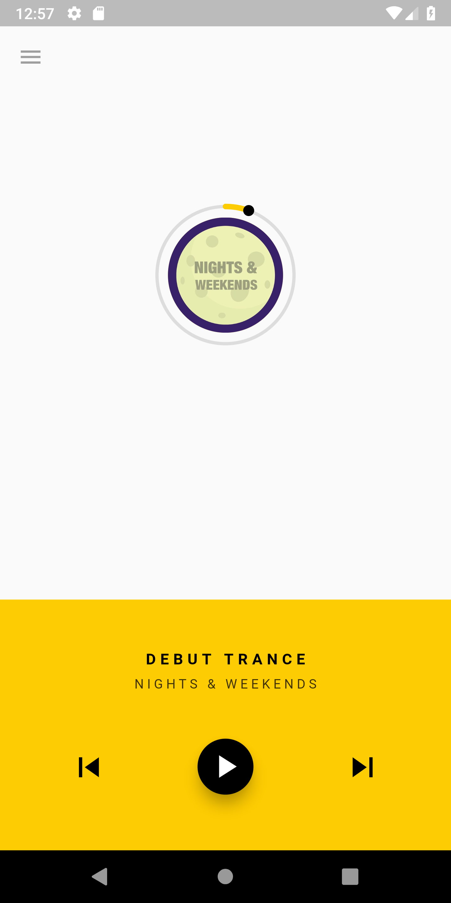

# Flutter Music Player

First Open Source Flutter based Beautiful Material Design Music Player(Online Radio will be added soon.)

# Demo App

[Play Store BETA](https://play.google.com/store/apps/details?id=com.mtechviral.fluttermusicplayer)

## Features

* [] Android (iOS Coming Soon)

  * [] Fetch local songs (Inbuilt Permission)
  * [] Beautiful UI with multiple themes(Coming Soon)
  * [] Animation
  * [] Full Fledged Example
  * [] play (local files)
  * [] stop
  * [] pause
  * [] seek
  * [] shuffle
  * [] Album Art
  * [] onComplete
  * [x] onDuration / onCurrentPosition

* Supported formats

  * [Android](https://developer.android.com/guide/topics/media/media-formats.html)

### Show some :heart: and star the repo to support the project

### Screenshots

  

## iOS

### Alert: iOS implementation

This project is not implemented for ios yet.So wait for it or if you can contribute then please do help.

# Pull Requests

I welcome and encourage all pull requests. It usually will take me within 24-48 hours to respond to any issue or request. Here are some basic rules to follow to ensure timely addition of your request:

### Created & Maintained By

[Márcio Quimbundo](https://github.com/MarcioQuimbundo) 

# License

    Copyright 2018 Márcio Quimbundo

    Licensed under the Apache License, Version 2.0 (the "License");
    you may not use this file except in compliance with the License.
    You may obtain a copy of the License at

       http://www.apache.org/licenses/LICENSE-2.0

    Unless required by applicable law or agreed to in writing, software
    distributed under the License is distributed on an "AS IS" BASIS,
    WITHOUT WARRANTIES OR CONDITIONS OF ANY KIND, either express or implied.
    See the License for the specific language governing permissions and
    limitations under the License.

## Getting Started

For help getting started with Flutter, view our online
[documentation](http://flutter.io/).

For help on editing plugin code, view the [documentation](https://flutter.io/platform-plugins/#edit-code).